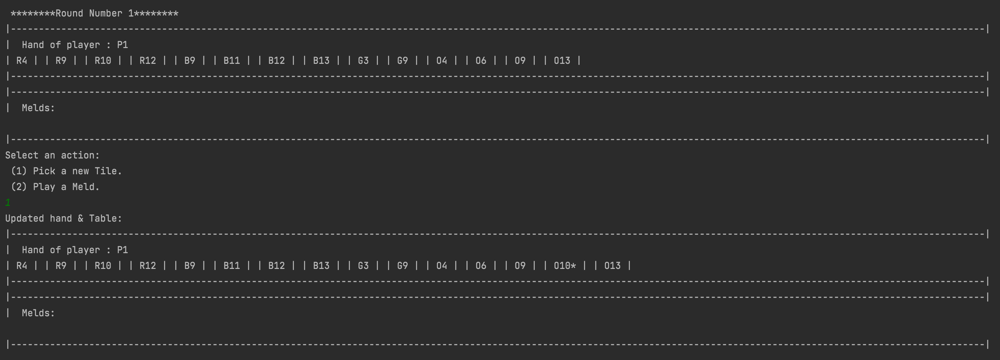
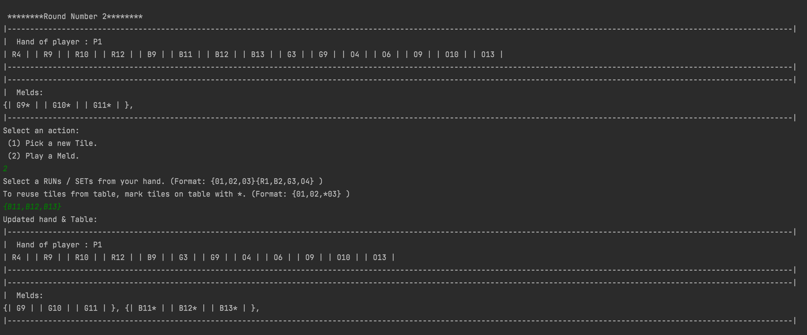
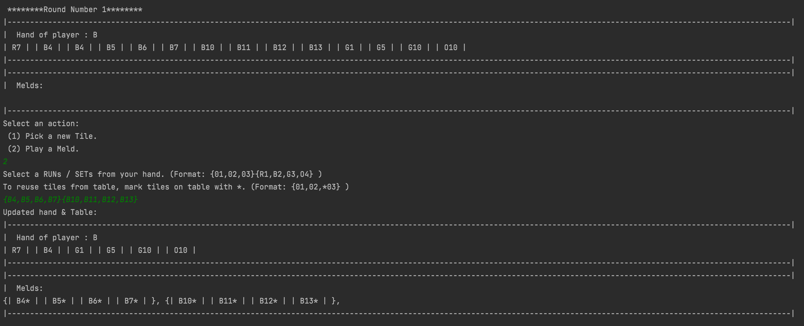
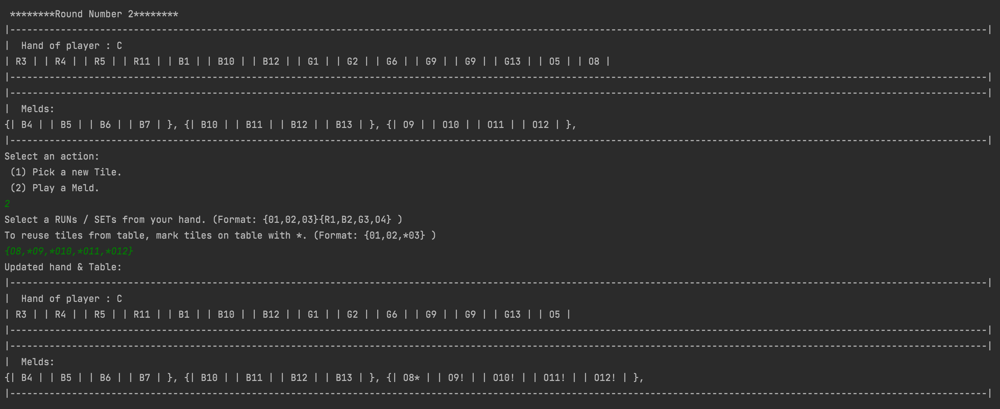
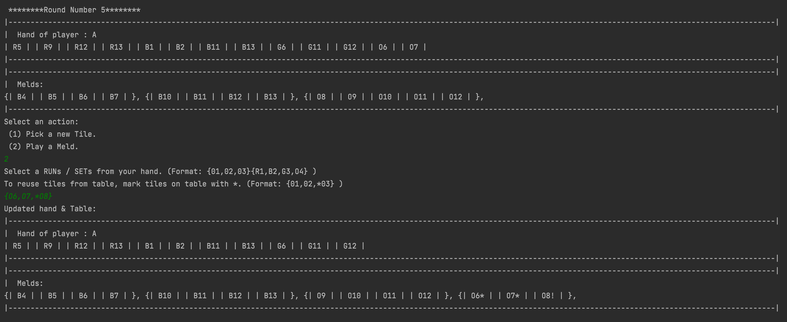
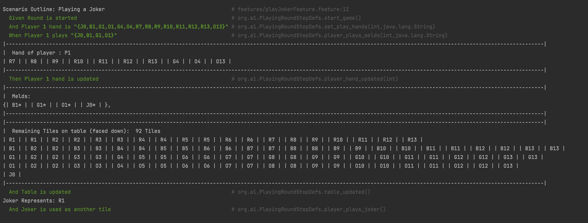
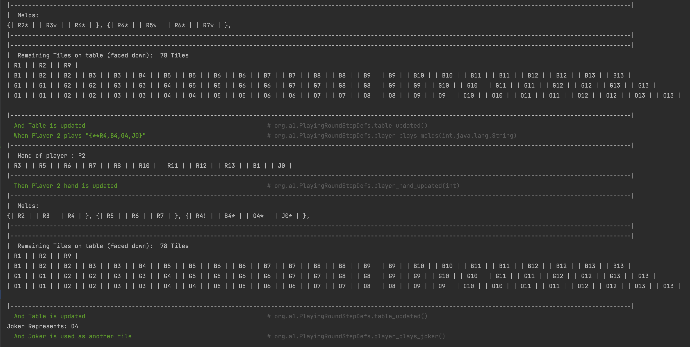
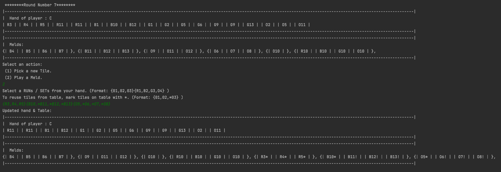

# Tile-Rummy
## COMP 4004 - Assignment 1

##### **Name, Student #:**    *Anant Ojha*,  *101072523* 
 
GamePlay Instructions:

1. Drawing a new Tile  

2. Playing a new Meld  
Single Meld
   
Multiple Melds
   

3. Reusing Tiles  
Adding Tile to Meld on Table
   
New Meld from Splitting Melds on Table
   

4. Using Jokers  
Using joker in a meld
   
If 2 of the same tiles are on the table, choose which to reuse by using 1 or 2 astrisks.
   

SAMPLE PLAY - (New Melds + Reuse Combined)
 
   
